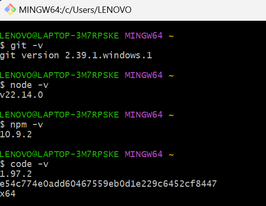

# Laporan Praktikum

|  | Pemrograman Berbasis Framework 2024 |
|--|--|
| NIM |  244107027010|
| Nama |  Bimo Cahyo Kusumo |
| Kelas | TI - 4K |

## Jawaban Praktikum 1

1. `Git` - Perangkat lunak yang berfungsi sebagai Version Control System (VCS) untuk menyimpan, mengelola, dan  berbagi source code. 
   `VS Code` - Perangkat lunak text editor yang biasa digunakan programmer untuk menulis kode program dalam membangun sebuah website atau aplikasi. 
    `NodeJS` - Runtime environment untuk JavaScript sehingga code dapat berjalan di sisi server (sehingga tidak terbatas hanya dengan browser)

2. Screenshoot telah menginstall tools tersebut 

    

## Jawaban Praktikum 2

1. Istilah-istilah saat penginstallan project NextJS

    

    | Tech Stack | Keterangan |
    | ------ | ------ |
    | TypeScript | Superset dari JavaScript yang menambahkan fitur `static typing`, sehingga membantu dalam pengembangan dengan deteksi kesalahan lebih awal dan peningkatan keterbacaan kode.|
    | ESLint | Tools yang berfungsi untuk mengidentifikasi dan melaporkan pola-pola yang ditemukan dalam kode JavaScript agar kode program menjadi lebih konsisten dan menghindari bug. |
    | Tailwind CSS | Framework CSS berbasis `utility-first` yang memungkinkan pengembangan antarmuka pengguna dengan cepat melalui kelas-kelas siap pakai yang fleksibel. |
    | App Router | Sistem routing bawaan NextJS yang berbasis file system dan mendukung fitur seperti server components. |
    | Turbopack | Bundler modern yang dikembangkan oleh tim Vercel sebagai pengganti Webpack, dirancang untuk kecepatan lebih tinggi dalam membangun aplikasi Next.js.|
    | Import alias | Fitur yang memungkinkan penggunaan `alias` dalam import untuk menghindari path yang panjang dan kompleks.|

2. Kegunaan folder dan file pada struktur project NextJS

    

    | Folder/File | Keterangan |
    | ------ | ------ |
    | `.next/` | Direktori yang berisi hasil kompilasi dan build produksi dari aplikasi NextJS|
    | `node_modules/` | Direktori yang menyimpan semua package dan dependensi yang diinstal melalui npm atau yarn. |
    | `public/` | Direktori untuk menyimpan file statis seperti gambar, font, dan favicon yang bisa diakses langsung dari root URL aplikasi. |
    | `src/` | Direktori utama yang berisi kode aplikasi termasuk komponen, halaman, dan logika bisnis. |
    | `src/app/favicon.ico` | File icon yang akan ditampilkan pada tab browser. |
    | `src/app/global.css` | File CSS global yang berisi style yang berlaku untuk seluruh aplikasi, termasuk konfigurasi Tailwind CSS|
    | `src/app/layout.tsx` | Komponen layout utama yang membungkus seluruh halaman aplikasi. |
    | `src/app/page.tsx` | Halaman utama (homepage) aplikasi yang akan ditampilkan pada root URL. |
    | `.gitignore` | File yang menentukan file/folder mana yang tidak perlu dimasukkan ke dalam version control Git.|
    | `eslint.config.mjs` | File konfigurasi ESLint untuk menjaga standar dan kualitas penulisan kode. |
    | `next-env.d.ts` | File deklarasi TypeScript untuk Next.js yang menyediakan definisi tipe untuk fitur-fitur Next.js. |
    | `next.config.ts` | File konfigurasi utama Next.js untuk mengatur perilaku aplikasi, routing, dan fitur-fitur Next.js lainnya.|
    | `package.json` | File yang mendefinisikan metadata project, script, dan daftar dependensi yang digunakan. |
    | `package-lock.json` | File yang mengunci versi dependensi agar instalasi konsisten di berbagai environment. |
    | `postcss.config.mjs` | File konfigurasi PostCSS untuk pemrosesan CSS dan integrasi dengan tools seperti Tailwind.|
    | `README.md` | File yang berisi referensi ke dokumentasi lebih lanjut tentang pengembangan atau penggunaan proyek, seperti API documentation, arsitektur proyek, dan cara berkontribusi.|
    | `tailwind.config.ts` | File konfigurasi Tailwind CSS untuk mengatur tema, komponen, dan utilitas styling. |
    | `tsconfig.json` | File konfigurasi TypeScript yang mengatur bagaimana TypeScript mengompilasi kode project.|

3. Screenshoot running project

    